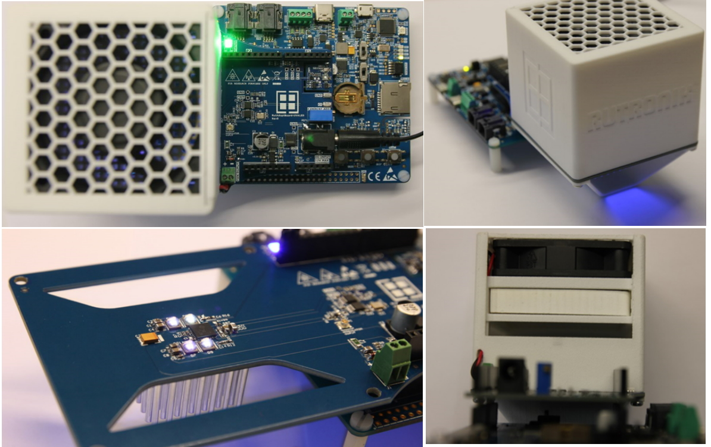

# RutAdaptBoard-UVA LED Odor Eliminator

This is an odor-eliminator concept. The ultra-high frequency PWM is used to generate UVA light Trichel pulses that are exposing the TiO2 catalyst. The VOC – Volatile Organic Compounds are degrading on the TiO2 catalyst surface down to the harmless and odorless components.

## Legal Disclaimer

The evaluation board including the software is for testing purposes only and, because it has limited functions and limited resilience, is not suitable for permanent use under real conditions. If the evaluation board is nevertheless used under real conditions, this is done at one’s responsibility; any liability of Rutronik is insofar excluded. 

